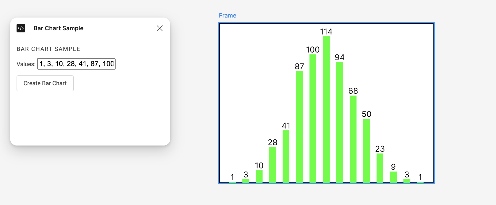

Local dev

```
npm install -g typescript

npm install

cd barchart

npm install

tsc
```

Figma desktop app

```
Open new design file

Plugins > Development > import ./barchart manifest.json

Plugins > Development > Bar Chart
```